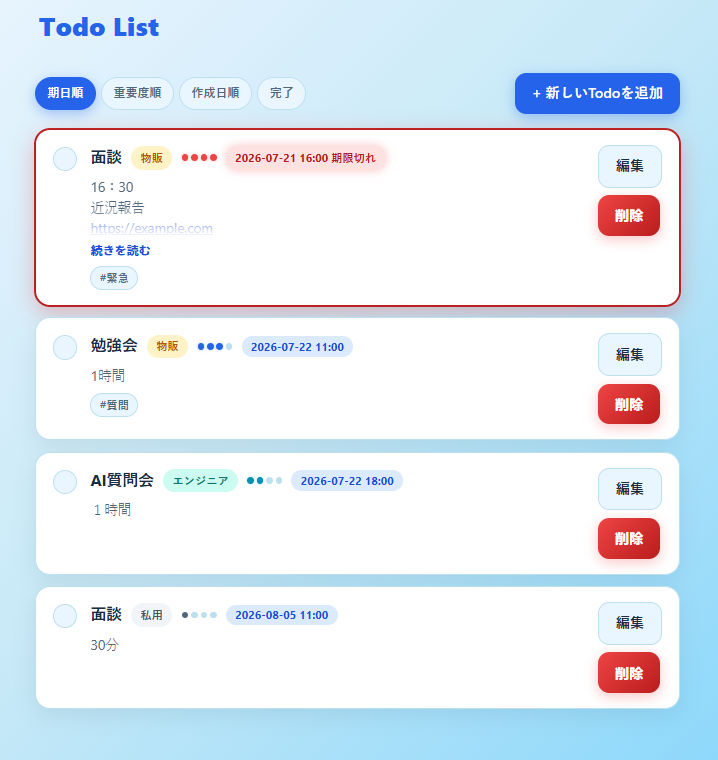
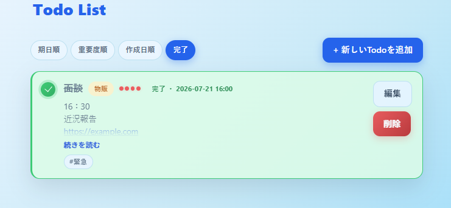
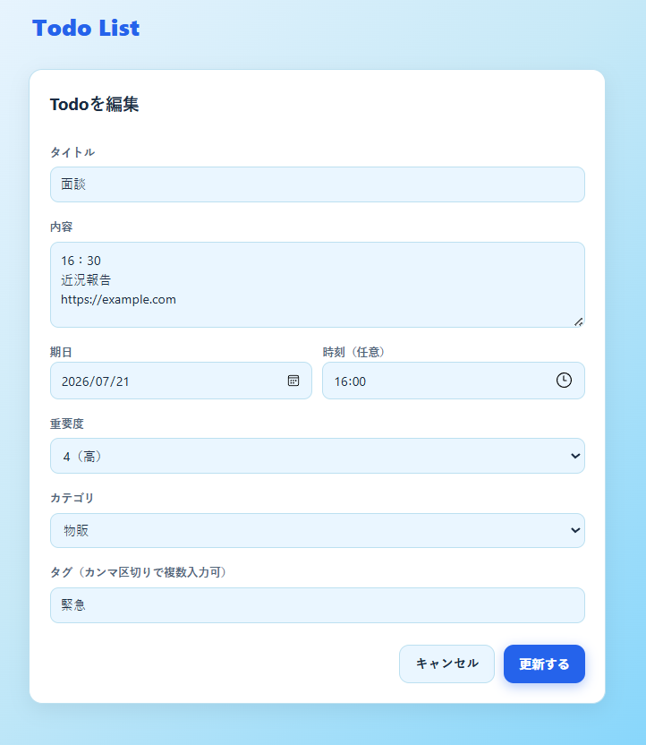

# Todo List App

Python(FastAPI)製のTodoリスト管理Webアプリ。データはGoogleスプレッドシートに保存する。





## 機能

- Todoの登録・編集(タイトル・内容・期日・重要度・カテゴリ・タグ・時刻)
- 削除
- 完了/未完了の切り替え
- 一覧表示(期日順/重要度順/作成日順の切り替えタブ、期限切れは赤色で強調表示)
- 完了タブ(完了したTodoは自動的にこちらへ移動、直近完了順)
- 重要度(1〜4段階、色分けドット表示)
- カテゴリ分け(本業/物販/案件/私用/エンジニア、色分けバッジ)
- タグ(複数付与可能)
- メモ欄(URL自動リンク化、長文は折りたたみ表示)

## 技術スタック

| 項目 | 内容 |
|------|------|
| バックエンド | FastAPI |
| テンプレート | Jinja2(サーバーサイドレンダリング) |
| データストア | Google スプレッドシート(gspread + サービスアカウント認証) |
| デプロイ先 | Render |

仕様の詳細は [`docs/specs/todo-app-spec.md`](docs/specs/todo-app-spec.md) を参照。

## 開発の流れ

1. **機能要件の整理** — 標準的なTodoアプリ相当の機能(登録・編集・削除・完了管理)に絞り込み、認証なしで誰でも利用できる公開アプリとして仕様を決定
2. **初期実装** — FastAPI + Jinja2(サーバーサイドレンダリング)で構築し、データストアにGoogleスプレッドシート(gspread + サービスアカウント認証)を採用
3. **デプロイ** — Renderにデプロイし、公開URLを発行
4. **配色をピンク系に変更**
5. **配色を青系に変更**([#1](https://github.com/yurin02/todo-list-app/pull/1)) — タイトル・ボタン・背景グラデーションなどのアクセントカラーを見直し
6. **完了ステータスの可視化**([#2](https://github.com/yurin02/todo-list-app/pull/2)) — 完了したTodoをカードの色分け・バッジで分かりやすくし、連携先のGoogleスプレッドシートにも条件付き書式で色分けを反映

## ローカルでの起動方法

### 1. 依存関係のインストール

```bash
python -m venv .venv
source .venv/Scripts/activate  # Windows(Git Bash)
pip install -r requirements.txt
```

### 2. Googleサービスアカウントの準備

1. [Google Cloud Console](https://console.cloud.google.com/iam-admin/serviceaccounts) でサービスアカウントを作成
2. 「キー」タブから JSON形式の鍵を作成・ダウンロード
3. [Google Sheets API](https://console.cloud.google.com/apis/library/sheets.googleapis.com) を有効化
4. 保存先にしたいGoogleスプレッドシートを、ダウンロードしたJSON内の `client_email` に「編集者」権限で共有

### 3. 環境変数の設定

`.env.example` を参考に `.env` を作成する。

```
GOOGLE_CREDENTIALS_JSON={"type": "service_account", ...}  # JSONファイルの中身を1行で
GOOGLE_SHEET_ID=xxxxxxxxxxxxxxxxxxxxxxxxxxxxxxxxxxxxxxxxx  # スプレッドシートURLの /d/ と /edit の間の文字列
```

### 4. 起動

```bash
uvicorn app.main:app --reload
```

`http://127.0.0.1:8000` で確認できる。

## Renderへのデプロイ

1. GitHubにリポジトリをpushする
2. [Render](https://dashboard.render.com/) で「New +」→「Web Service」からこのリポジトリを選択
3. 以下を設定
   - Build Command: `pip install -r requirements.txt`
   - Start Command: `uvicorn app.main:app --host 0.0.0.0 --port $PORT`
4. 環境変数タブで `GOOGLE_CREDENTIALS_JSON` と `GOOGLE_SHEET_ID` を設定(値は上記と同じ)
5. デプロイ完了後に発行されるURLで公開される

デプロイ済みURL: https://todo-list-app-g6c7.onrender.com

## データ構造(スプレッドシート `Todos` シート)

| 列 | 内容 |
|----|------|
| ID | UUID |
| Title | タイトル |
| Content | 内容 |
| DueDate | 期日(YYYY-MM-DD) |
| Status | `pending` / `done` |
| CreatedAt | 作成日時 |
| UpdatedAt | 更新日時 |

シートとヘッダー行はアプリ初回起動時に自動作成される。
